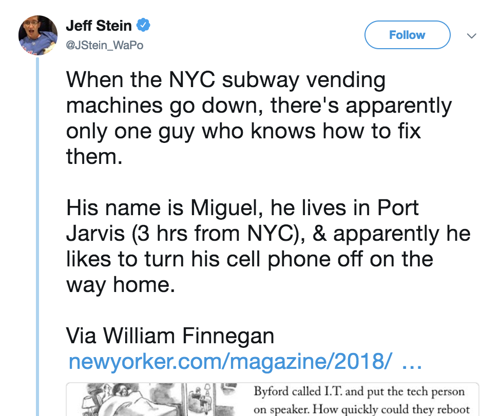
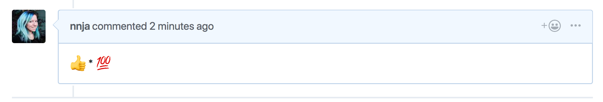
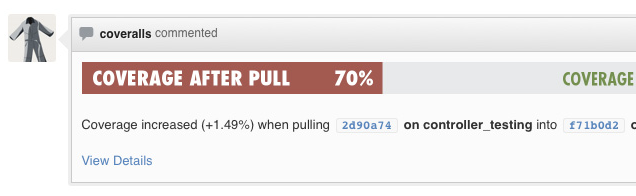

autoscale: true
build-lists: true
slidenumbers: true
footer:  [@nnja](http://www.twitter.com/nnja)

[.hide-footer]

## Nina Zakharenko
# Code Review Skills for Pythonistas
##  @nnja
## bit.ly/py-code-review

^
- Hi. I'm Nina.
- I've been writing code professionally for over a decade, and I've worked at companies you might have heard of, like HBO, Meetup, and reddit 
- These days I work at Microsoft as a Cloud Developer Advocate
- That's our mascot bit. If you think bit is cute, find me after the talk for a sticker.
- Today we're going to talk about code review skills for pythonistas
- Show of hands:
	- how many have been a part of code reviews?
	- how many of you have only had positive code review experiences? 

<!--

themes I like:
business class #2

ostrich grey & pink
or white (and adjust highlight color)       

poster

letters from sweden, with different header font

TODO
- check mine and maxes notes from open source bridge
- grab theme from pink laptop, how to share themes between computers?
- fix random fucking captializations
- talk about beyond PEP8
- more python and vs code stuff
- check speaker notes in powerpoint
- watch original talk and take notes
- make hot links in slides

- talk about pre-commit hooks, include code

- mention pulling down the review to your own computer

Notes:
Talk a little bit about why we want to code review
have you thought about why you do it, besides for my boss told me so, or it's a habit on my team?

Look up interesting VS Code feature that can help
- integrated github pull requests in vs code
- live screen sharing
- format on save (i.e. with black)

think about less slides, how to condense them

Add bit about checking in with yourself. Have you eaten, gotten enough to drink? Do you need a walk? Are you stressed?

-->

---

# What we'll learn today [1/2]

- What are the benefits of review?
- TODO

^
- Firstly, Who’s the target audience? 
both team leaders and developers. 
Today, I’ll talk about: [*]
- why we review [*]
- what the benefits are [*]
- go over tools that make reviews better and easier for python developers
- the hardest aspect of reviews -- the human aspect

---

# What we'll learn today [2/2]

- How to review code for maximum impact
- How to submit reviews 
- Use code review to build a stronger team

^
- next, I’ll give specific examples of how to be an effective reviewer, **[*]** and an effective submitter **[*]**
- lastly, I’ll share how to use these tools to build a stronger team

---

# Not one size fits all!

- team size
	- 2 vs 10
- product type
	- agency vs in-house
- defect tolerance
	- jet engines vs mobile games

^
- This talk is not one size fits all - I’m offering suggestions - You need to Adjust them to your work situation. 
- What are Factors?: [*] [1] team size - taking the time to review will affect a team of 2 much greater than a team of 10
- [*] [2] product type - if you’re an agency, you might have tighter deadlines, more incentive to try to just push code out the door.
- [*] [3] What is defect tolerance? The rate of failure that’s acceptable in your software
- [3] if you’re dealing w: money? medical equipment? you should have a lower defect tolerance than a web app or a game

--- 

# [fit] Why Code Review?

^
-  First, we should answer the question 
- why should we bother with code review?

---

# [fit] Code Reviews Can   Be Frustrating

^ 
- On the surface, the code review process can appear really frustrating.
- Just Look at this developer.
- She is so angry at the idea of reviewing code that she’s eating her laptop!
- We don't want that to be us

---

# Apparent Code Review Frustrations

 - Adds time demand
 - Adds process
 - Can bring up team tensions
 - “smart” devs think they don’t need it

^
What are some apparent code review frustrations?
- [advance] 
- **[1]** adds a time demand. this is especially noticeable on a smaller team [*]
- **[2]** it adds process. everyone hates process, right?[*]
- **[3]** the review process can bring up egos, personality incompatibilities, and can flare up hidden tensions between team members
- sometimes we'll run into a smart dev who thinks their code is too good to be reviewed

---

# [fit] Code Review Benefits

^ 
- How do you get people to change the way they work?
- Inspiring change is always difficult.
- People get comfortable in routines.
- If you don’t already code review, or don't review regularly, how should you go about introducing the concept?
- Start by selling the benefits.
- in the short term frustrations are inevitable
- When you first start, expect things to be slow going.
- But, In the long term it’ll make your life easier.
- Like with all things, the more practice you have the better your velocity will be over time
- It took 2 months until it became 2nd nature for me

---

# Find Bugs & Design Flaws

 - Design flaws & bugs can be identified and remedied before the code is complete
 - Case Studies on Review:
 - ⬇ bug rate by 80%
 - ⬆ productivity by 15%

[.footer: [Coding Horror - Code Reviews](https://blog.codinghorror.com/code-reviews-just-do-it/)]

^ 
- What’s the biggest benefit?
- Design Flaws & Bugs can be found and fixed before the code is done [advance]
- Multiple Case studies from IBM, AT&T Microsoft, have shown
	- code review can lower bug rate by up to **80%**
	- increase productivity by up to **15%**

---

## The goal is to find bugs **before your customers** do

^
- At the end of the day, The goal is to find bugs **before your customers** do

----

# Shared Ownership

 - We’re all in this together
 -  👀 results in positive motivation
 -  Overall increase in code quality

^
- Reviews help us feel a sense of shared ownership.
- It reminds us that we’re all in this together
- When I know someone will be looking, it motivates me to write better code
- This positive motivating pressure results in an increase in code quality

---

# Shared Knowledge

 -  No developer is the only expert
 -  Developers gain familiarity with modules via review
 -  Decrease the “Lottery" Factor

^
- Reviews also help us share knowledge through the team
- No developer is the only expert
- As a developer, you can gain familiarity with different parts of the code base by doing reviews
-  Decrease the “Lottery" Factor

---

# "Lottery" Factor 

[.footer:[New Yorker: Can Andy Byford Save the Subways?](https://www.newyorker.com/magazine/2018/07/09/can-andy-byford-save-the-subways)]

^
- What is the lottery factory? 
- measurement of how much concentrated specialized knowledge belongs to individual team members
- example: When the NYC subway vending machines go down, there's only one person that knows how to reboot the system
- and he turns his phone off on his commute home. 
- that's bad enough
- What happens if Miguel wins the lottery, decides he doesn't want to work another day in his life?
- will one person sabotage the project if they left tomorrow?

---

# Leave a Paper Trail
 - Code reviews add a wealth of knowledge!
 - Why was a particular technical decision made?

^
- Code reviews leave behind a paper trail 
- It can leave behind a wealth of knowledge about why a particular technical decision was made. 
- A good code review tool will let you review comments and dialogue that were left before a merge.

---

# Code Review Benefits?
- Find Bugs
- Shared Ownership
- Shared Knowledge
- Reduce "I Quit" Factor
- Leave a Paper Trail

^
What are the benefits of code review?
- we can find more bugs faster
- we share ownership in the product
- we share knowledge about our code
- we reduce the lottery factor
- and we leave a paper trail about technical decisions 

---

# [fit] I've become a much **better programmer** by participating in code reviews

<!--
Process?

- GitHub (lots of other tools exist)
- GitHub reviews (this was so painful before they existed)
- Blocked merging (can't merge without a green check)

<!-- TODO NZ: Fix this slide -->

^
- It’s not just anecdotes.
- I’ve worked as a dev for many years. I used to think I knew it all.
- Then I started at a company with a great review culture
- as a result, i’ve grown into a better programmer
- because there’s always an opportunity to learn from others
- I started anticipating what a reviewer might point out, before even getting to the review process.

---

# [fit] Get started 

^ Let me share a few key points on how to start a review culture if you don't have one, or improve your current process if you do

---

# It starts with a commitment

- Make a commitment to always review before merge
- Present the facts
- Don’t force it
- New ideas take time to root

^ 
You need to start with a commitment [*] to always review before merging code [*]
Present the facts: 
- there have been Many case studies and research papers over the past few years supporting reviews. I’ll talk about a few. [*]
- Suggest it, show the research,but Don’t force it. [*]
- New ideas take time to root.

---

# Code Reviews need to be Universal

- Doesn’t matter how senior / junior you are
- Only senior devs reviewing `==` bottleneck
- Inequality breeds dissatisfaction

^
- code reviews need to be universal.
**[1]** everyone on the team should be submitting and reviewing code. no matter junior or senior
**[2]** if only senior dev do reviews, you’ve created a bottle neck
**[3]**  Worked with a developer in a Java shop who insisted on formatting his code C++ style instead of Java style - diff in where starting brace goes
- Made for nightmare diffs, and frustration among the team maintaining his code.
- I protested. I was told “that’s OK - he’s allowed to do that” - because Bob was the most senior engineer
- Many of you shaking your heads, but true story. You need to break down existing status quo for the idea to take root.

---

### Code Review is done by your **peers** & **not management**

^
- Code review should be done by your peers, not by management.
- The end goal isn’t getting someone “in trouble”
- Bugs found during the code review process should never come up in performance reviews
- That’s why we do review in the first place

---

# Consistent Code

- Your code isn’t yours, it belongs to your company
- Code should fit your company’s expectations and style *(not your own)*
- Reviews should encourage consistency for code longevity

^
- Review encourages Consistent Code
- Need to remember an important fact:
	- The code you write isn’t yours. It belongs to your company.  [*]
	- Code should fit company style and expectations, not your own. [*]
	- Reviews that encourage consistency make your code more robust. [*]
- Because no one stays at a company forever, code longevity is an important factor

---

# Style Guide

- Distinguishes personal taste from functionality
- Should be agreed upon before hand
- Go [beyond PEP8](https://www.youtube.com/watch?v=wf-BqAjZb8M)
- See: Google's [`pyguide.md`](https://github.com/google/styleguide/blob/gh-pages/pyguide.md)
- Great codebases are written by a team, look like they were written by an individual.

^ 
- What’s a style guide? [*]
- A style guide distinguishes your personal taste from functionality [*]
- Ok, many of you are thinking: isn't that what PEP8 is for?
- No, not really. PEP8 only scratches the surface, and offers suggestions. 
- Google has a lengthy style guide. goes through pros and cons of each decision
- style guides need to be agreed upon by the team before introducing code reviews. [*]
- Because great code bases are written by a team but, they look like they were written by an individual.
- Doesn’t matter which one you choose. Pick one and stick with it.

---

# Formatters - Black

- TODO

---

# [fit] Consistent Code is **Easier to Maintain** by a Team

^
- Bob wasn’t in the wrong.
- Maybe C++ style formatting is in fact better.
- The problem was he wasn’t following convention.
- Consistent code will be easier to maintain by a team.

---

# No Blame Culture

- Failure is inevitable
- Mistakes become team, not individual responsibility
- Needs management support

^
- Reviews work best in a ‘No Blame Culture’ [*]
- Accept that failure is inevitable  [*]
- When the team reviews code, The team becomes responsible for code quality, not an individual. [*]
- Needs management support  [*]
	- if you get in trouble for sharing your mistakes, you’ll brush them under the rug next time.
	- No blame culture should encourage teammates to openly talk about bugs found during review

---

# Blameless Post Mortem

- Meet shortly after incident resolution
- Understand the root cause
- Document how it was fixed
- Identify how to prevent it in future

^
- As a bonus, I want to briefly touch on blameless post mortems, even though it’s a post-review process.
- **[1]** What is it? A blameless post mortem meeting happens shortly after every incident.
- **[2]** It lets you learn what the exact root cause was
- **[3]** During the meeting document the events leading up to the issue. Create a timeline.
- **[4]** Now you can learn from it, and figure out ways to prevent it from happening again. Don’t just talk about it, remember to create and assign tickets.

---

# [fit] For a blameless culture, don’t **point fingers!**

^
- Who caused it is not part of the conversation
- This process will only work if punishment is off the table
- If developers think they’re going to get in trouble, **they’re not going to be honest about making mistakes**
- if you’re encouraged to share instead, everyone on the team can learn from mistakes
- Having a blameless post mortem is a great way for managers to show support of a no blame culture.

---

# [fit] When code reviews are part  of the culture, people don’t expect their  changes to be reviewed,  **they want** their  changes to be reviewed.

^
- When code reviews are part of the culture, developers will are not just going to expect review.
- they’re going to WANT it. look forward to it, 
- and be excited about the process

---

# Let's Review: Code Review Fundamentals

- Make a commitment
- Universal code review
- Performed by Peers
- Style guide for consistency
- No blame culture

^
How do we implement a culture of code review?
- Make a commitment
- Code Reviews should be Universal
- They should be performed by your peers
- style guides encourage consistency
- healthy reviews all starts with a no blame culture

---

# How should we code review?

^
- How should we code review?
- There are two steps in learning how to perform reviews.

--- 

# #1: Be a great reviewer

---

^
Therapist asks: 
- why do you think you’re so hostile in code reviews?
Dev laments: 
- if only I had been more popular in HS
- code review should not look like an appointment with your therapist. 
- Approach it objectively and without ego. Need to leave emotions behind. 
- Have empathy
- hostility is especially not necessary

---

## Be Objective   
### [fit] “**this** method is missing a docstring” _instead of_  “**you** forgot to write a docstring”

^
- Be objective. [*]
- this method is missing a doctoring [*]
- instead of [*]
- you forgot to write a doctoring [*]
Reviews are a learning opportunity, not a chance to catch someone being wrong.

---

# [fit] Ask Questions Don’t Give Answers

- “Would it make more sense if... ?”
- “Did you think about... ? ”

^
Ask Questions, don’t give answers [*]
- would it make more sense if… ? [*]
- did you think about… ? [*]

---

# [fit] Offer suggestions

- “it might be easier to”
- “we tend to do it this way”

^
Offer Suggestions [*]
- say things like
- it might be easier to… [*]
- we tend to do it this way instead… [*]
It’s better to offer suggestions than to give ultimatums

---

# [fit] Avoid these terms

- Simply
- Easily
- Just
- Obviously
- Well, actually...

^
Avoid these terms: [advance]
- Simply, Easily, Just, Obviously.
- They’re condescending!
- If it was so obvious, the submitter would not have done it in the first place.
- They might be missing context, or unaware of a concept. [advance]
- Well, actually is another one to avoid. You say it when someone says something mostly correct, but you interrupt them to make a minor correction

---

## [fit] ... now, simply

^
- [anecdote] I'm not sure if any of you practice yoga, but this happens in my class all the time. The teacher will twist herself into a pretzel, and then tell the students to “now simply… 
- [advance]
- touch your feet behind your head
-I don’t think any of  you would consider this simple! I certainly don't

---

# [fit] Have Clear Feedback

- Strongly support your opinions
- Share **How & Why**
- Link to supporting blogs, stackoverflow examples, or documentation.

^
- To be effective, you need to have clear feedback `[*]`
- Your opinions need to be strongly supported to have maximum impact `[*]`
- Share how you would implement your suggestion, and why you think the change is necessary  `[*]`
- Link to blogs, documentation, and other resources that back up your opinions. `[*]`
- Don’t feign surprise if someone doesn’t know something, even if you consider it a basic concept. 
- *gasp* I can’t believe Dave doesn’t know about the singleton design pattern.

---

# [fit] This is **not** clear feedback

---

# [fit] Compliment good work and great ideas

^
- Remember to compliment good work and great ideas
- I like to leave a thumbs up when I see:
- a good refactoring, some code clean up, or a particularly elegant solution
- Reviews shouldn’t be all about the bad

---

# Don't be a perfectionist

^
- You don’t want to be a perfectionist.
- this tweet says it better than I can
- “The goal is better code, not exactly the code you would have written”

---

# Don’t be a Perfectionist

 - For big issues, don’t let perfect get in the way of perfectly acceptable.
 - Prioritize what’s important to you.
 - Usually 90% there is good enough.

^
- [1] for big issues, don’t let perfect get in the way of perfectly acceptable
- [2] prioritize what’s important to you
- [3] usually 90% of the way there is good enough
- When you press for complete perfectionism, you take ownership away from the person who wrote the code.
It takes away their feelings of accomplishment and creativity.

---

# It’s OK to Nit-Pick

 - Syntax Issues
 - Spelling Errors
 - Poor Variable Names
 - Missing corner-cases
 
 Save the nit-picks for last, after any pressing architecture, design, or other large scale issues have been addressed.
 
^
Don’t be a perfectionist, but it’s OK to Nitpick the small stuff.
- [1] syntax issues
- [2] spelling errors
- [3] bad variable names
[4] missing corner-cases
You might ask:
- What’s the harm in letting a few of these pass by?
Broken window theory 
- if I see sloppy code, I assume it’s OK to check in sloppy code. 
- Save the nit picks for last, after you’ve addressed the big stuff like
architecture concerns
or
design decisions

---

### Avoid Burn-Out
Studies show reviewer should look at 200-400 lines of code at a time for maximum impact[^1].

[^1]: https://smartbear.com/learn/code-review/best-practices-for-peer-code-review/

[.hide-footer]

^
As a reviewer, you want to avoid getting burned out
Studies show that you should only look at 200-400 lines of code at a time for maximum impact

---

### Avoid Burn-Out

Limit Reviews to 200-400 lines between 60 and 90 minutes, then take a break[^1].

[^1]: https://smartbear.com/learn/code-review/best-practices-for-peer-code-review/

[.hide-footer]

^
In practice, reviewing between 200 and 400 lines over 60 to 90 minutes will let you find 70-90% of the bugs. 
So, if 10 bugs existed in the code, a properly conducted review would find between 7 and 9 of them.
Studies show after 500 lines, the ability to find bugs drops dramatically
- If the code stops making sense, you’re too tired. You might miss something.

---

# Do Reviews in 24-48 hours

^
- Good rule of thumb: Do Reviews in 24-48 hours after they’re submitted.
- This is especially easy when reviews are small. 500 lines of code
- This lets you look at reviews incrementally, prevents buildup
- Also means the code is fresh in the submitter’s mind for questions
- [advance] don’t want to end up like this guy, who’s still waiting for a code review.

---

# Define Done

 - Let the submitter know if you approve, or if you’re waiting for changes.
 - Use consistent language
	 - LGTM or Changes Requested
 - Follow up when the submitter says they fixed something

^
- For good communication, Define Done [advance]
- When you’re finished, say if the review is complete or if you’re waiting for the submitter to make changes [advance]
- Use consistent language. when you’re done you can say My personal favorite: ship it! or lgtm.
- If the submitter needs to push code based on your comments, say ‘Changes Requested’
- Make sure you follow up and actually the check code when the submitter says they pushed a fix.

--- 

# [fit] How can we be a Great Reviewer?

- Have Empathy
- Watch your Language
- Have Clear Feedback
- Give Compliments
- Don’t be a Perfectionist

^
- How can you be a great reviewer?
- Have Empathy
- Watch your Language
- Have clear Feedback
- Give compliments for good work
- Don’t be a perfectionist

---

# [fit] How can we be a Great Reviewer?

 - Avoid Burn Out
 - Complete in 24-48 hours
 - Define Done

^
- Avoid Burn out. Take Breaks
- But, don’t leave your teammates hanging. Finish reviews in 24-48 hours.
- Lastly, define done.

--- 

# Be a Great Submitter

^
- We’ve spent time talking about how to be a great reviewer
- There’s 2 sides of the coin
- For effective reviews, we need to learn how to be a great submitter too.

---

---

# Don’t get rubber-stamped.

^
- ## **[*** halfway point]**
- Q: What’s rubber stamping? 
- When a submitted solution is so complex, the Reviewer thinks it’s obvious the author knows what they’re doing.
- They just approve the code without fully understanding it.

---

# [fit] Don’t be clever.
# [fit] **Readability Counts!**

^
- Don’t be too clever.
- Submitting over complicated code is a surefire way of getting rubber-stamped.
- I have a developer friend who used to love showing off how smart he was by checking in complex over engineered solutions
- He stopped doing it when he realized he was punishing himself. It meant that he always ended up being the maintainer of it.
- Remember that readability counts. 

---

> Good code is like a good joke.
It needs no explanation.
- Russ Olse

^
- Russ Olsen said it best.
- Good code is like a good joke. It needs no explanation.
- If you feel like a piece of code is confusing, it is. 
Leave a comment, either in code or in your review tool.
Better yet, refactor it so it’s more readable

---

Stages of Review

**0:** before submission
**1:** submitted
**2:** (optional) work in progress (30-50%)
**3:** almost done (90-100%)
**4:** review completed

<!-- TODO this slide is confusing -->

^
- Let’s go through the stages of a Review
- 0: before you submit it
- 1: submitted
- 2: (this step is optional) showing work in progress. 
	— at this stage the code is 30-50% done.
- 3: almost done. 
	— here, we’re 90-100% done
- 4: the review is completed

---

# [fit] step 0:
# [fit] before submission

^
Now we’re at step 0
things we need to do before we even think about starting the review

---

# [Fit] Provide Context (The Why)

- What was the motivation for submitting this code?
- Link to the underlying ticket/issue
- Document why the change was needed ◉ For larger PRs, provide a changelog
- Point out any side-effects

^
- the most important thing you can do to help the reviewer
- is provide context. WHY did you write this code? [*]
- Link to the underlying ticket or bug report [*]
- If there’s not enough context in the ticket, provide extra context [*]
- For larger reviews, consider providing a change-log [*]
- And try to remember to point out unintended side effects [*]

---

# [fit] **YOU** are the
# [fit] Primary Reviewer

 - Review your code with the same level of detail you would give giving reviews.
 - Anticipate problem areas

^
- Now that you’ve provided the context,
- remind yourself that YOU are the primary reviewer
- review your own submitted code as if you were giving a review
- this lets you anticipate problem areas

--- 

# [fit] The Primary Reviewer

- Make sure your code works, and is thoroughly tested.
- Don’t rely on others to catch your mistakes.

^
- As the primary reviewer, it’s your responsibility to make sure
	- your code works
	- and it’s throughly tested
- always QA Your own changes.
- Because you don’t want to rely on others to catch your mistakes

---

# [fit] Before submitting, try a **checklist**

^
- One way you can be a better submitter is to try a checklist before you submit your code.
- What makes a good check list?

---

# [fit] ☑︎ small stuff

- Did you check for reusable code or utility
methods?
- Did I remove debugger statements?
- Are there clear commit messages?

^
 - check off the small stuff [*]
 - did you look for reusable code or utility methods?
 - did you remove all your debugger statements
 - a`re your commit messages clear?

---

# [fit] ☑︎ big stuff

 - Is my code secure?
 - Will it scale?
 - Is it resilient against outages?
 
 Tip: Read the Checklist Manifesto

^
- Also use the opportunity to check for the big stuff.
- is your code secure?
- is it going to scale?
- I highly recommend a book called the checklist manifesto. 
- It’s a book about how having checklists helped doctors make surgery safer, and pilots deal with disaster better. 
- Checklists can help developers too

---

# [fit] step 1:
# [fit] submitted

^
now we’re at step 1
you submitted the review.

---

# You’re starting a conversation.

- Don’t get too attached to your code before the review process
- Anticipate comments and feedback
- Acknowledge you will make mistakes

^
- At this point, you’re starting a conversation [*]
- don’t get too attached to your code before the review even starts [*]
- anticipate comments and feedback. [*]
- lastly, acknowledge that you will make mistakes [*]
- Remember that the entire point of a review is to find problems, and problems will be found. 
- Don’t be caught by surprise.

---

# [fit] step 2:
# [fit] *(optional)*
# [fit] work in progress

^
now, we’re at step 2 which is optional
submit work in progress

---

# [fit] Submit **Work in Progress** Pull Requests

- Necessary for bigger features
- Don’t be afraid of showing incomplete, incremental work
- Open them your code is 30-50% done
- This is the right time to get feedback on architectural and design decisions

^
- What’s the benefit of submitting work in progress?
- It’s really helpful for bigger and more complicated tasks
- As a rule of thumb, open them when you’re 30-50% done.
- You can’t be afraid of showing incomplete work. This drives the perfectionists crazy.
- This stage is the right time go get feedback on bigger issues.

---

# [fit] When Code is Work in Progress

Feedback to expect:

- Architectural issues
- Problems with overall design
- Design pattern suggestions

^
- When your code is a work in progress - [*]
- what kind of feedback should you expect? [*]
- architectural issues [*]
- overall design problems [*]
- recommendations for design patterns to use [*]
at this stage, you want to get feedback early & often.

---

# [fit] step 3:
# [fit] almost done

^
step 3:
- we’re almost done!
- we can see the finish line

---

# [fit] When Code is Almost Done

- Feedback to expect:
- Nit Picks
- Variable Names
- Documentation & Comments
- Small Optimizations

^ 
- What kind of feedback can we expect with the code is almost done? [*]
- nit picks [*]
- variable names [*]
- requests for more documentation or comments [*]
- small optimizations [*]
- As the code evolves, it becomes more firm.
- No one wants to hear “change it all!” at this phase
- This process prevents wasting time and effort for bigger, more complex pull requests.

---

# [fit] One Review per Issue

 - If you’re solving multiple problems, break them up into multiple PRs for ease of review.
 - Solved an unrelated problem? make a new PR with a separate diff
 - You can branch off your feature branch to keep the diff small

^
- This is the point at which you ask yourself -
- Did I also end up solving an unrelated problem? [*]
- “ Did I only solve one issue with my pull request?” 
- if the answer is no, break up the code into multiple reviews [*]
- you can even branch your code off a feature branch. this will keep the diff small 

--- 

# Prevent Reviewer Burnout

- Remember, reviews lose value when they’re more than 500 lines of code[^1].
- Keep reviews small and relevant.
- If submitting a big review is unavoidable, give the reviewer extra time.

[^1]: https://www.microsoft.com/en-us/research/wp-content/uploads/2016/02/bosu2015useful.pdf

^
- We want to keep reviews small to prevent reviewer burn-out. [*]
- Remember I mentioned earlier, reviewers are not as effective when they look at more than 500 lines of code [*]
- Keep it small and relevant [*]
- if a big review is unavoidable, give the reviewer some extra time. [*]

---

# [fit] ✔ Check Code
# [fit] with **Automated Tools**

^
We can use automated tools and static analysis to streamline the review process

---

# [fit] ✔ Linter

^
- What is code linting? 
- it’s an automated way of checking syntax 
- or even style guide violations
- or if you want to get fancy, you can set it up to check style guide violations too
- this is an example of a python linter
- Linter can integrate with your code editor.
- This way the reviewer doesn’t have to waste time pointing out syntax problems

<!-- TODO NZ talk about formatting, and how some tools allow you to automatically format on save -->

---

# [fit] ✔ Tests

 - Write them!
 - Don’t know code health if tests are failing
 - Tests identify problems immediately

^
- Tests. [*] 
- Write them!! [*]
- Tests need to be passing for someone new to be able to meaningfully contribute.
- Because you don’t know the status of your overall code health if they’re failing. [*]
- Tests help you identify problems immediately.
- Not going to go into too much detail. There are many great talks and resources on testing.

---

^
If I haven’t stressed the importance of tests enough, - remember
no one wants to work with the scumbag programmer who commits untested code
don’t let this be you!

---

# [fit] ✔ Continuous Integration

automated build with every push

^
- What is Continuous Integration? - automated build with every push.
- run compiler
- run tests
- this should happen a few times a day
- Lots of available tools, Travis, CircleCI. 
- almost all of them integrate with Github pull requests

---

# [fit] ✔ `coverage.py`

#### % of code executed when running a test suite

<!-- TODO talk more about coverage.py -->

^
- what’s coverage?
- its the % of code that’s executed when a test suite runs.
- Remember we talked about fault tolerance
- If you have low fault tolerance - for example (if your code fails, will someone get stuck in an MRI machine?) coverage can be a necessary tool

---

# [fit] ✔ coverage

- Coverage tools integrate into GitHub
- `coverage.py`
- [coveralls.io](http://coveralls.io)

^
- coverage tools integrate into github too
- for python, use coverage.py
- there’s also a product that works with lots of different languages called coveralls
- here’s an example coveralls report integrated into github
- Automation saves everyone time.

---

# [fit] step 4:
# [fit] review complete

^
- Now we’re at the last step
- The reviewer has finished looking at your code.

---

# [fit] Be Responsive

 - Reply to every comment
 - Common Responses:
 	- Resolved
 	- Won’t Fix
- If you won’t fix, make sure you’ve come to a mutual understanding with the reviewer

^
- But, we might not be done.
- If the reviewer left comments, we need to be responsive. [*]
Reply to each one [*]
Common responses: resolved, or won’t fix [*]
If you respond with won’t fix be sure you explained by [*]

---

# [fit] It’s still a Conversation

If there were comments, let your reviewer know when you’ve pushed changes and are ready to be re-reviewed.

^
- At this point, it’s still a conversation
- After the first pass, let the reviewer know when your code is ready to be reviewed again.

---

# [fit] Don’t Bike-Shed

- [bikeshed.com](bikeshed.com)
- back & forth > 3 times? step away from the keyboard
- talk instead!
- record the results of the conversation in the review

^
**what is bike shedding** - arguing over minor, marginal issues while more serious ones are being overlooked. i.e people arguing over what color to paint the bike shed while the house is not finished.
- If you're going back and forth more than 3 times, it's time to step away from the keyboard.
- Use your words instead.
If you're co-located, great. Stop by and have a chat. If your remote Hop on a video call.
Record the result of the conversation in the PR for posterity.

---

# VS Code Live Share 

[.hide-footer]

^
- If you're co-located, great. Walk to the other person's desk.
- If not, check out vs code live share

---

# Fight for what you believe, but **gracefully accept defeat.**

^
- Disagree with the reviewer's comments? No radio silence. 
- Carefully Explain what the reviewer might have missed. 
- Open a friendly discussion until you understand why the reviewer left the comment. 
- Maybe the reviewer missed your thought process.
- But, maybe you’re just wrong.
[advance slide] Learn to admit defeat.

---

# [fit] Don’t take feedback personally. It’s an **opportunity for growth.**

^
- Admitting that you don't know something is hard.
- Don’t take it personally.
- You are not your code. 
- Use it as an opportunity to grow
- Remember, we’re all working towards the same goal - to ship code.
- Be grateful, offer thanks that someone spent the time to review your code.\

---

# [fit] How to be a Great Submitter?

 - Provide the Why (context!)
 - Review your own code
 - Expect Conversation
 - Submit in progress work

^
- How do we be a great submitter?
- Provide the why
- review your own code first
- expect a conversation
- submit work in progress

---

# [fit] How to be a Great Submitter?

- Use automated tools
- Be Responsive
- Accept Defeat

^
- use automated tools
- be responsive
- when necessary, accept defeat

---

# Code Reviews Build a **Stronger Team**

^ code reviews sound like hard work, and they are. but now you can reap the rewards
^ Use that as an advantage
when someone new joins!

---

# First day vibes...

^
- It doesn’t matter how much experience you have.
- on your first day, you probably feel something like this….
- [advance]
- “I have no idea what I’m doing”

---

# [fit] Newbies

- Not everyone has experience being reviewed.
- Remember what it felt like when you introduced the process.
	- Ease into it!

^
- The new person joining your team might not have experience being reviewed.
- If you've never had someone look at your code before, it's easy to get scared. "What are they all going to think?"
- Remember your first review.
- Ease the new person into the process. 

---

# [fit] On-boarding

 - The first submitted review is always the hardest
 - Start by reading recently completed reviews
 - First review should be small.
 - Share the style guide

^
When you onboard:
- Encourage the newbie to read recently completed reviews before submitting their own
- Remember the 1st review is the hardest.
- First few reviews should be small. Don't let someone stumble around in the dark on the wrong path.
- Share the style guide so expectations are set.
- expectations are good, but don't be rigid. evaluate new ideas or best practices the employee  may have brought over from a previous org.

---

# [fit] Everyone’s a Reviewer

 - Junior devs start by doing pair-reviews with a more experienced teammate.
 - Use it as a mentorship opportunity.

> “When your team succeeds, you succeed.”

<!-- TODO find a way to work in some of kate heddlesons blog post -->

^
- Everyone should be a reviewer. How does this work with junior people? [*]
- A study showed that familiarity with the code was an important factor in increasing the likelihood of providing useful comments. [*]
- Instead of muscling out newer or inexperienced teammates, have them do pair review with a more experienced one until they are more familiar with the code base. [*]
- Use it as a mentorship opportunity. [*]

---

> Hiring senior engineers is hard. You can hire junior engineers, and **grow them** into functional productive parts of your team.
- Sasha Laundy

^
Sasha Laundy said it best during a talk on Giving & Getting Technical Help. She said:
Hiring senior engineers is hard. 
Instead, you can hire junior engineers, and grow them into functional and productive parts of your team 
Use your culture of review and knowledge sharing as a competitive advantage to make this process faster and easier.

---

# [fit] If you’re not doing code reviews, **you’re missing a big opportunity**.

^
- Code review is prove-ably shown to improve code quality across all kinds of organizations and code bases.
- If you’re not doing code reviews, you’re missing a big opportunity.
- Think about what’s blocking your team from trying some of the techniques we talked about
- And Figure out ways of eliminating those blockers

---

# [fit] Remember...

 - Allocate the time
 - Develop, don’t force the culture
 - Not one size fits all
 - Or a one stop fix
	- Use in addition to tests, QA, etc for maximum impact

^
- Remember that for a successful culture - [*]
- You need to allocate the time  [*]
- Let the culture grow organically, don’t force it [*]
- These ideas are not one size fits all [*]
- And code reviews are not a one stop fix. [*] They need to be used in addition to tests, QA, and other methods for maximum impact.
- If code reviews are not already in place, anticipate stumbling blocks but in no time at all you'll say a pay off in less buggy more maintainable code.

---

# What did we learn?

^
What’s the most important thing we learned about code reviews today?

---

# reviews decrease WTFs/m by increasing code quality long term
 

^
- at a minimum, code reviews decrease wtFs per minute
- [advance]
- and, as we know, this is the only valid measurement of code quality
- we all want to work with the team on the left!

---

# less WTFs ➡ happier devs!

^
when you have less WTF moments every day, you have happier developers.

---

[.hide-footer]

# Thanks!    
## slides: TODO
## [aka.ms/python](aka.ms/python)
##  **[@nnja](http://www.twitter.com/nnja)**

^ If you have comments, questions, or feedback
^ If you agree with me, or disagree with me
^ Please send me a message on twitter or an e-mail, I'd love to hear from you!

<!-- todo monitored link -->
 
---

# [fit] Resources & Additional Reading
* [Microsoft Study on Effective Code Review](https://www.microsoft.com/en-us/research/wp-content/uploads/2016/02/bosu2015useful.pdf)
* [Code Reviews: Just do it](https://blog.codinghorror.com/code-reviews-just-do-it/)
* [Code Project - Code Review Guidelines](http://www.codeproject.com/Articles/524235/Codeplusreviewplusguidelines%20and)
* [Great Example Checklist](http://insights.dice.com/2012/10/31/whats-on-my-code-review-checklist/)
* [Best Practices for Code Review](https://smartbear.com/learn/code-review/best-practices-for-peer-code-review/)
* [Rebecca's Rules for Constructive Code Review](https://storify.com/ReBeccaOrg/rebecca-s-rules-for-constructive-code-reviews)
* [My Big Fat Scary Pull Request](https://medium.com/@jdan/my-big-fat-scary-pull-request-2c8ac394540e#.yhs96vbxu)
* [The Gentle Art of Patch Review - Sage Sharp](http://sage.thesharps.us/2014/09/01/the-gentle-art-of-patch-review/)

---

# [fit] Example Style Guides
* [Python](https://www.python.org/dev/peps/pep-0008/)
* [Javascript](https://github.com/airbnb/javascript)

Google has many good, but strict style guides at: [https://github.com/google/styleguide](https://github.com/google/styleguide)

Doesn't matter which one you use. Pick one and stick with it.